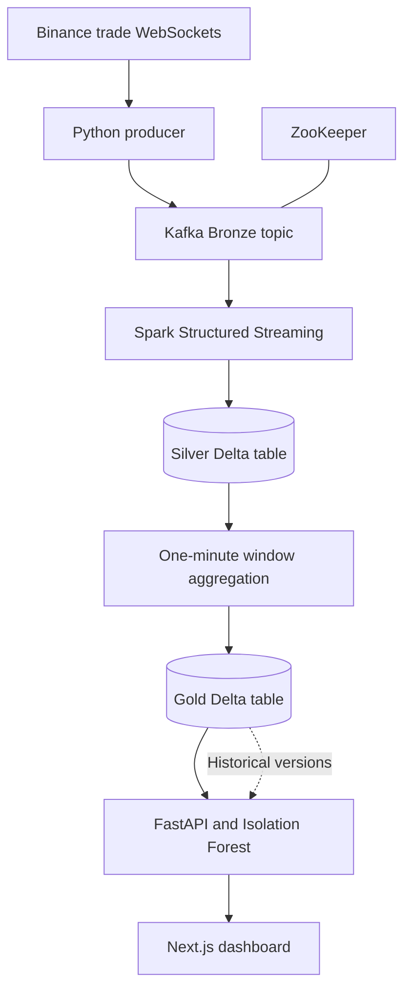

# Real-Time Market Lakehouse

A streaming data engineering project that turns cryptocurrency trades into
queryable market data: Binance WebSockets → Kafka → Spark → Delta Lake →
FastAPI → a Next.js dashboard.

The project explores how ingestion, stateful aggregation, versioned storage,
and an experimental anomaly detector fit together in one local system. It
currently handles **BTC/USDT, ETH/USDT, and SOL/USDT**.

## What it implements

- **Trade ingestion:** a Python producer forwards Binance trade events to the
  `bronze_market_trades` Kafka topic.
- **Silver tables:** Spark parses the event schema and converts timestamps,
  prices, and quantities into typed Delta rows.
- **Gold tables:** one-minute windows produce open, high, low, close, and volume
  fields, partitioned by symbol.
- **API and dashboard:** latest bars, symbol switching, a rolling price chart,
  and a slider for reading previous Gold table versions.
- **Experimental ML:** an Isolation Forest flags unusual combinations of closing
  price and volume once a symbol has at least ten bars.

This is a local development prototype. Performance, anomaly quality, and recovery
behavior have no published benchmark in this repository.

## Architecture



The unified [orchestrator](medallion_orchestrator.py) bootstraps the Silver and
Gold schemas, then runs both streams in one Spark session using `local[2]`.
Silver triggers every five seconds; Gold triggers every ten seconds with a
ten-second event-time watermark. Completed bars appear after their windows
close and the watermark advances. The dashboard polls current data every five
seconds, so it displays aggregated bars rather than a tick-by-tick feed.

| Layer | Implementation |
|---|---|
| Broker | Confluent Kafka and ZooKeeper images `7.5.0` |
| Processing | PySpark `3.5.0`, Delta Spark `3.1.0` |
| API | FastAPI `0.110.0`, delta-rs Python package `deltalake==0.16.0` |
| ML | scikit-learn `1.4.1.post1`, Isolation Forest |
| Dashboard | Next.js `16.1.6`, React `19.2.3`, Tailwind CSS, Recharts |

Versions come from [requirements.txt](requirements.txt),
[docker-compose.yml](docker-compose.yml), the orchestrator's Maven package
configuration, and [frontend/package.json](frontend/package.json).

## Run locally

Use a Linux, WSL, or compatible development environment with Python 3.11,
Java 11 or 17, Docker Compose, and Node.js 20.9 or newer. Set `JAVA_HOME` to
your JDK. Kafka, Spark, and the frontend run as separate processes; allow
memory for the JVM alongside the Docker containers. Network access is needed
for dependency downloads, Spark's Maven packages, and the Binance stream.

### 1. Install dependencies

```bash
git clone https://github.com/RAMZI0TO99/realtime-market-lakehouse.git
cd realtime-market-lakehouse
python3.11 -m venv .venv
source .venv/bin/activate
python -m pip install -r requirements.txt
python -m pip install requests
```

`api_server.py` imports `requests`, but it is currently missing from
`requirements.txt`; the separate install is required even with Telegram alerts
disabled. The dependency versions and commands here follow the checked-in
source; this README does not claim a newly validated end-to-end installation.

### 2. Start Kafka, then ingestion

```bash
docker compose up -d
docker compose ps
python ingestion_producer.py
```

Keep the producer running. It retries the Kafka connection while the broker
starts. Wait for incoming trade messages before starting Spark; the producer
creates traffic on `bronze_market_trades`. Host processes connect to Kafka at
`localhost:29092`.

### 3. Start the unified pipeline

In a second terminal, from the **repository root**:

```bash
source .venv/bin/activate
python medallion_orchestrator.py
```

Keep it running. Spark downloads its Kafka and Delta connectors on first use.
The pipeline writes `data/silver_market_trades`, `data/gold_market_metrics`,
and `checkpoints/` relative to the current directory. On its first start it
reads new Kafka events from the latest offsets; allow fresh trades to arrive.

Use the unified orchestrator for this walkthrough. The separate
`silver_transformer.py` and `gold_aggregator.py` scripts are alternative
experiments with different settings and Gold schemas; they share output paths
and checkpoints and should not run alongside it.

### 4. Start the API

In a third terminal, from the **same repository root**:

```bash
source .venv/bin/activate
python api_server.py
```

Open the interactive API documentation at `http://localhost:8000/docs`.
The API reads the same local Gold directory as Spark. Starting it from another
directory can make it appear that no data exists.

### 5. Connect the dashboard

Before launching the frontend, edit `API_BASE` in
[frontend/app/page.tsx](frontend/app/page.tsx). Replace the checked-in
Codespaces address with the address reachable from your browser:

```typescript
const API_BASE = "http://localhost:8000";
```

The frontend does not currently read an API URL from an environment variable.
For a remote development environment, use its forwarded HTTPS API address
instead, and ensure your browser can reach it.

In a fourth terminal:

```bash
cd frontend
npm ci
npm run dev
```

Open `http://localhost:3000`. Select BTC, ETH, or SOL. Allow several minutes
for two completed bars before expecting a price chart; anomaly detection starts
only after at least ten bars for the selected symbol.

## Inspect the data

With the API running:

```bash
curl http://localhost:8000/api/v1/market/status/BTCUSDT
curl http://localhost:8000/api/v1/market/versions
curl http://localhost:8000/api/v1/market/timetravel/BTCUSDT/0
```

| Endpoint | Behavior |
|---|---|
| `/api/v1/market/status/{symbol}` | Latest bar and anomaly flag; returns `waiting` until at least two bars exist |
| `/api/v1/market/versions` | Latest Gold Delta commit version |
| `/api/v1/market/timetravel/{symbol}/{version}` | Up to 20 closing prices from that table version |

Version `0` may contain only the empty bootstrap table. Use a later version
from the versions endpoint to inspect populated history. Delta versions identify
table commits rather than individual market timestamps.

## Limitations and next steps

- **Aggregation correctness:** `first` and `last` are used without explicit
  event-time ordering, so open/close values need validation before treating
  them as canonical exchange candles. Prices and volumes use doubles.
- **ML evaluation:** the API refits one shared Isolation Forest on each eligible
  status request and scores a row included in that fit. There is no held-out
  evaluation, persisted model, or measured flash-crash detection accuracy.
- **Recovery:** checkpoints track stream progress, but `failOnDataLoss=false`
  permits Kafka gaps to be skipped. The Compose file has one broker and no
  persistent volume configuration; this is not a durable deployment setup.
- **Serving:** the API loads the Gold table into pandas on requests. It has no
  authentication and currently uses wildcard CORS with credentials enabled;
  deployment needs explicit origins and an access-control design.
- **Observability:** several read/fetch errors become empty or waiting states.
  Check producer/Spark logs, the API response, and the dashboard's API address
  when the chart remains empty.

Telegram alert hooks exist but are disabled by placeholder configuration. They
are optional and are not needed for the local walkthrough.

## Project files

| Path | Purpose |
|---|---|
| [ingestion_producer.py](ingestion_producer.py) | Binance WebSocket to Kafka ingestion |
| [medallion_orchestrator.py](medallion_orchestrator.py) | Silver and Gold streaming pipeline |
| [api_server.py](api_server.py) | Delta queries, anomaly scoring, optional alerts |
| [frontend/](frontend/) | Dashboard source and frontend commands |

See [LICENSE](LICENSE) for the repository's existing license.
